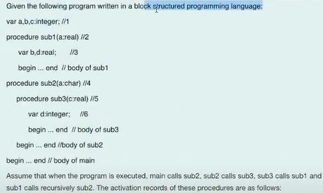
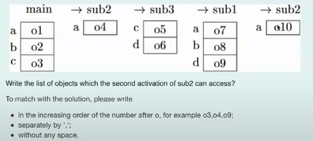

1. Alias, write the aliases created.
```c++
int x = 0;
int *a = &x;
int *b = a;
int d = *a // d = x = 0, but 2 int object
```
- Solution: *a,*b,x
1. Evironmental referencing.
- block-structuring language -> static scope.
```pascal
// main
var a,b,c:integer; //1
procedural sub1(a:real) //2
    var b,d:real; //3
    begin ... end 
procedure sub2(a:char) //4
    procedure sub3(c:real) //5
        var d:integer; //6
        begin ... end 
    begin ... end
begin ... end // body of main
```
- Solution: for sub3
  - c//5,d//6;a//4,sub3,b//1,sub1,sub2 
- Note:
  - Static scope lang: static rule + dynamic rule.
  - Dynamic scope lang: dynamic rule.
3. Scope rule
- When code is executed or run -> dynamic scope.
- Dynamic rule of static language -> go from main down.
- Dynamic rule of dynamic language -> go back from current record.
- Example:
  


1. Gabage or alias
```c++
int *a = new int;
int foo(int *&b){
    int c = 0;
    b = new int; // cause gabage 'new int'
    return c;
}

int main() {
    int d = foo(a); // cause alias 'a, b'
    a = &d; // cause gabage 'new int'
    return *a;
}
```